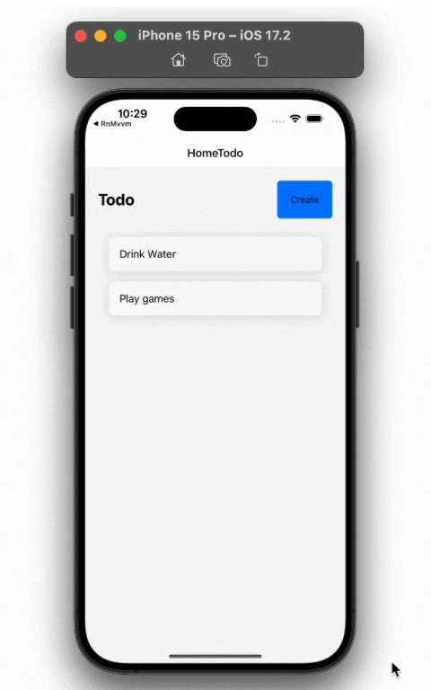

# Todo List Application

## Description

The **Todo List Application** is a React Native project that demonstrates the implementation of the **MVVM (Model-View-ViewModel)** architecture. This architecture provides a clear separation of concerns, making the application modular, scalable, and easier to maintain.

### Features

- **Task Management:** Create, read, update, and delete tasks.
- **MVVM Architecture:** Utilizes a structured approach to separate UI, business logic, and data management.
- **Cross-Platform:** Compatible with both iOS and Android.

### Architecture Overview

- **Model (`src/store/todoSlice.js`):**
  - Manages the state and business logic of the application using Redux. The `todoSlice` handles actions and reducers related to todos.

- **ViewModel (`src/view-controller/useHomeTodoController.js`, `src/view-controller/useNewTodoController.js`, `src/view-controller/useUpdateTodoController.js`):**
  - Serves as an intermediary between the View and the Model. Custom hooks handle business logic and data preparation for the View.

- **View (`src/screens/HomeTodoScreen.js`, `src/screens/NewTodoScreen.js`, `src/screens/UpdateTodoScreen.js`):**
  - Displays the user interface and captures user input. React components use ViewModel hooks to get data and handle interactions.

### How It Works

1. **Model (`src/store/todoSlice.js`):**
   - Defines the structure and methods for managing task data. It interacts with local storage to persist tasks.

2. **ViewModel (`src/view-controller/useHomeTodoController.js`):**
   - Provides data and handles user actions. For example, `useHomeTodoController` fetches todos from the Redux store and allows deletion.

3. **View (`src/screens/HomeTodoScreen.js`):**
   - Renders the UI and interacts with the ViewModel to display tasks and handle user actions.

### Data Flow

1. **User Interaction:** Users interact with the View (e.g., clicking a button to create a new todo).
2. **ViewModel:** The ViewModel (e.g., `useNewTodoController`) processes interactions by calling methods like `createTodo`.
3. **Dispatch Actions:** The ViewModel dispatches actions to update the Redux state (e.g., `dispatch(createTodo({ title }))`).
4. **Redux State Update:** Redux updates the state using reducers (e.g., `createTodo` reducer updates the todos array).
5. **Re-render View:** The updated state is reflected in the View, causing components like `HomeTodoScreen` to re-render with the new list of todos.

### Getting Started

To get started with the Todo List Application, follow these steps:

1. **Clone the Repository:**
   
   git clone https://github.com/krupav03/MvvmArc.git

2. **Navigate to the Project Directory:**
   
   cd MvvmArc

3.Install Dependencies:

  npm install

4. Run the Application:

   npm start
   
6. Run on iOS Simulator or Android Emulator:

  npm run ios
  npm run android

  ## Feature Demo

## Feature Demo

Here's a demonstration of the feature:

**Happy Coding!**

